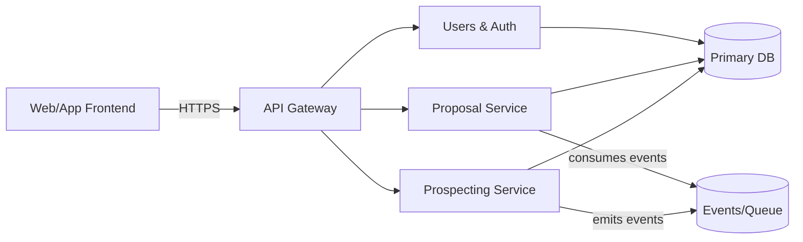
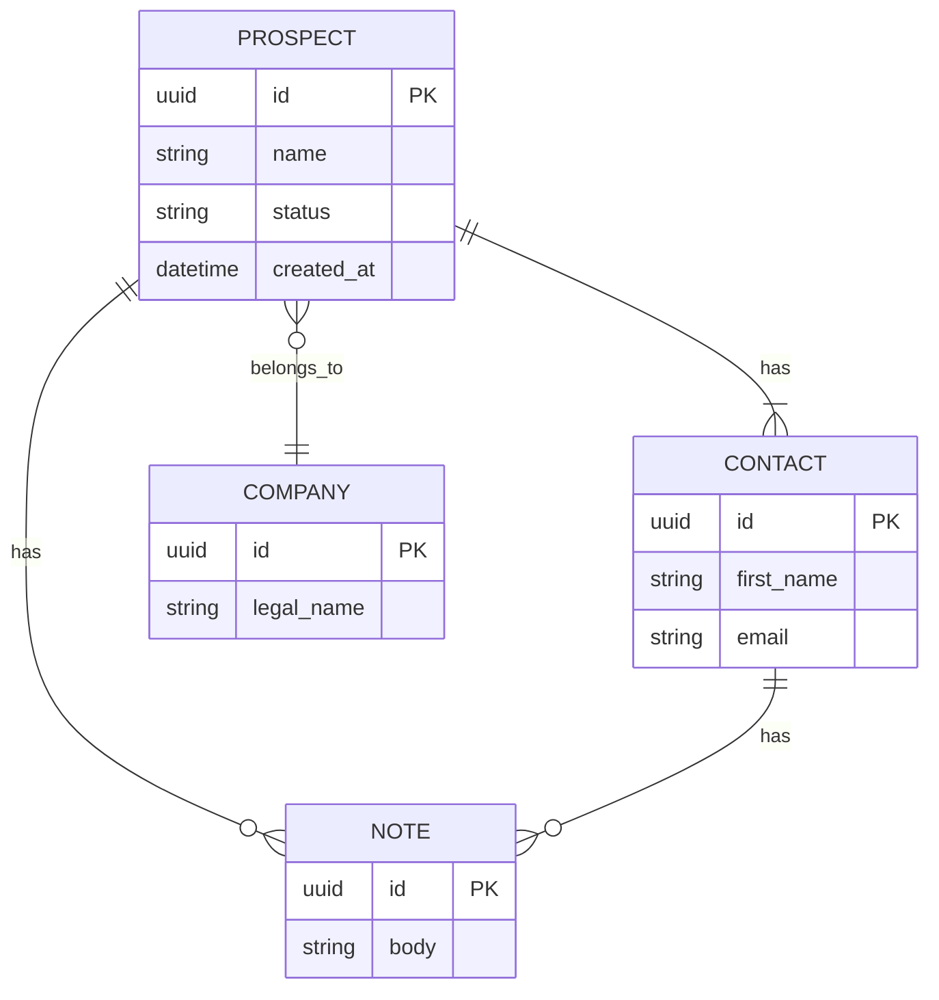
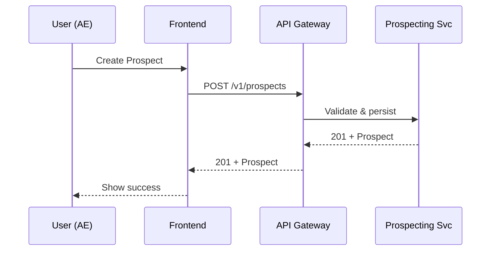

# Platform Modules & API Overview

---

## Table of Contents

1. [System Overview]
    
2. [Environments] 
    
3. [Module Catalog (High‑level)]
    
4. [Module Template (Copy per module)]
    
5. [PPT's]
   
6. [User and Permissions]
   
---
## System Overview

Short paragraph explaining the platform: major domains, who uses it, and the primary data flow.

---
## Environments:

In this section we can explain how our system perform deployments and branch handling.

- Dev
- UAT
- PROD

---

## Module Catalog (High‑level)

Fill this table first to give a quick map of the platform.

| Module      | Summary                                 | Core Models                | Primary APIs                         | FE‑Only/Non‑API work? |
| ----------- | --------------------------------------- | -------------------------- | ------------------------------------ | --------------------- |
| Prospecting | Intake & qualify leads                  | Prospect, Company, Contact | `/prospects`, `/contacts`            | No                    |
| Proposals   | Create & manage  propsals - SIP/Lumpsum | Proposal, LineItem, Tax    | `/proposals`, `/proposals/{id}/send` | No                    |
| Masters     |                                         |                            |                                      | No                    |
| Investments |                                         |                            |                                      |                       |
| GPT         |                                         |                            |                                      |                       |
| Review      |                                         |                            |                                      |                       |

---

## Module Template (This will be for all the modules present in module catalog)

**Purpose:** One‑liner describing the goal of this module.  
**Primary Users/Roles:** Available for which role
#### Domain Model

Briefly explain key models and relationships.

#### API Inventory
In this for respective model we can list their API's

| Resource | Method | Path         | Auth | Description                        |
| -------- | -----: | ------------ | ---- | ---------------------------------- |
| Prospect |    GET | `/prospects` | User | List prospects (paged, filterable) |
| Prospect |   POST | `/prospects` | User | Create a new prospect              |

#### End of the respective modules

---------

### PPT's

- In this part we can state different type of PPT's we make and their properties, how are they different from each other and the cons of using them.
- We can outshine our USP as well, that we can customize the PPT's in and out.

Review PPT
Proposal PPT
Performance
Analytics
Family Analytics

#### Typical Flows (Sequence)

This is an example diagram that I have created need, please let me know if we need something like this.

#### Permissions & Roles
- Here in this part we can share our Permission model how they are defined and what group is accessible to which permissions.
