```mermaid
flowchart TD
    subgraph Org["🏢 Organization"]
        Admin["🏢 Org Admin"]
        Member["👤 Members (RMs)"]
        Product["🛠 Product Support"]
        Operation["⚙️ Operational Support"]
    end

    Member -->|Handles| Clients["👥 Clients"]
    Clients --> ClientA["Client A"]
    Clients --> ClientB["Client B"]

```

```mermaid
flowchart TD
    PM[📑 Proposal Module] --> Data[📊 Data Gathering]
    PM --> Reports[📂 PPT Reports]
    PM --> Logic[⚙️ Business Logic]

    Reports --> Prop[💼 Proposal PPTs]
    Reports --> Perf[📈 Performance PPTs]
    Reports --> Ana[📊 Analytics PPTs]
    Reports --> Rev[🔄 Review PPTs]
    Reports --> Fam[👨‍👩‍👧 Family Analytics PPTs]

```

```mermaid
flowchart TD
    MM["🏛 Masters Module"]:::adminOnly --> Filter["📂 Filter Products - Buy | Sell | Hold"]
    MM --> Portfolio["📊 Model Portfolios"]
    MM --> Research["🔍 Asset Research"]
    MM --> Allocation["⚖️ Asset Allocation by Risk Profiles"]

    classDef adminOnly fill:#ffe6e6,stroke:#d33,stroke-width:2px;

```

# Platform Modules & API Overview

---

## **Table of Contents**

1. [System Overview]
    
2. [Environments] 
    
3. [Module Catalog (High‑level)]
    
4. [Module Template (Copy per module)]
    
5. [PPT's]
   
6. [User and Permissions]
   
---
## System Overview

Short paragraph explaining the platform: major domains, who uses it, and the primary data flow.

---
## **Environments:**

Our platform follows a **three-environment setup** to ensure smooth development, testing, and production release cycles. Each environment has a specific role in the software lifecycle:

#### 1. Development (Dev)

- **Purpose:** Used by developers to write, integrate, and test their code at an early stage.
    
- **Access:** Primarily internal (engineering team).
    
- **Key Activities:**
    
    - Feature development, bug fixes, and enhancements.
        
    - Unit testing and integration testing of new code.
        
    - Frequent deployments (multiple times a day possible).

#### 2. User Acceptance Testing (UAT / Staging)

- **Purpose:** Acts as a **mirror of production**, used for QA and business teams to validate functionality.
    
- **Access:** QA, Product Managers, limited business stakeholders.
    
- **Key Activities:**
    
    - End-to-end testing of new features.
        
    - Regression testing to ensure existing features are unaffected.
        
    - User acceptance testing (sign-off before production).

#### 3. Production

- **Purpose:** The **live environment** where real users interact with the system.
    
- **Access:** End-users, customers, and operations teams.
    
- **Key Activities:**
    
    - Serves real customer traffic.
        
    - Only thoroughly tested and signed-off features are deployed here.
        
    - Monitoring, logging, and incident management are critical.

![[Untitled diagram _ Mermaid Chart-2025-08-22-191249.png]]

---
## **Module Catalog (High‑level)**

| Module      | Summary                                                                                    | FE‑Only/Non‑API work? |
| ----------- | ------------------------------------------------------------------------------------------ | --------------------- |
| Accounts    | Ensure clear accountability and scalable team management.                                  | No                    |
| Investments | Maintain all investment-related analytics.                                                 | No                    |
| Proposals   | Create & manage  propsals.                                                                 | No                    |
| Review      | The Review module is our proprietary IP designed to assess and evaluate client portfolios. | No                    |
| Masters     | Customize the changes according to organization.                                           | No                    |

---
## **Roles and Permissions**

In our system, access control is designed using a **Role–Permission Model**.
#### Roles

Each user is assigned a role that defines their primary responsibility:

- **Admin (A):** Organization-wide control
    
- **Manager (M):** Member-level access
    
- **Operational Support (O):** Client-focused operations
    
- **Product Support (P):** Product & master data access
    
- **Client (C):** Limited client-only access
#### Permissions

Permissions are modular and based on **bitwise combinations**, allowing flexibility and scalability:

- **Standalone Permissions:** Basic read/write and client-level actions
    
- **Combined Modules:** Larger feature blocks like Instant Analysis, Proposals, and Review workflows
#### Permission Bundles

- **Client Module:** Client + Prospect access with Instant features
    
- **Prospect Module:** Prospect + Instant access
    
- **Master Module:** Master data read/write

This structure ensures **clear separation of responsibilities** while allowing **bundled access** for efficiency.

-------
## **Modules**

### 1.🏢 Accounts & Role Flow

Our system is structured around **Organizations**, ensuring clear accountability and scalable team management.
##### Organization

- Represents the company as a whole.
    
- Each organization has **one Org Admin** (the owner) with complete control.
##### Members

- Team members added under the organization.
    
- Each member is assigned a **role** (Manager, Operational Support, Product Support).
    
- Roles define their level of access and permissions.
##### Clients

- Clients are **not separate roles** but are linked under the **Member role**.
    
- Relationship Managers (RMs) handle their respective clients.
    
- This ensures every client is mapped to a responsible team member.
#### Domain Model

#### API Inventory

| Resource | Method | Path                        | Description                   |
| -------- | -----: | --------------------------- | ----------------------------- |
| Accounts |    GET | /accounts/clients/:clientID | List Account                  |
| Accounts |   POST | /accounts/auth/token        | Generate Authentication Token |

-----
### 2.💹 Investments Module

The **Investments Module** helps in shaping and understanding a client’s portfolio at both individual and family levels.
##### 1. Investment Policy

- Defines the **risk appetite** of the portfolio.
    
- Can be measured for an **individual client** or for the **entire family**.
    
- Forms the guiding principle for portfolio allocation and decision-making.
##### 2. Product Understanding

- Provides a **comprehensive view of the client’s portfolio**.
    
- Includes:
    
    - **External Transactions** (imported from outside platforms)
        
    - **External Portfolio** (holdings outside our system)
        
    - **Internal Portfolio** (holdings within our system)
        
    - **Complete Client Information** (all linked financial data)

### Domain Model

```mermaid
flowchart TD
    IM[💹 Investments Module] --> Policy[📑 Investment Policy]
    IM --> Product[📊 Product Understanding]

    Policy --> Risk[Risk Appetite]
    Policy --> Scope[Individual / Family Level]

    Product --> ExtTxn[🔗 External Transactions]
    Product --> ExtPort[🌐 External Portfolio]
    Product --> IntPort[🏠 Internal Portfolio]
    Product --> ClientInfo[👤 Client Information]

```

#### API Inventory
| Resource    | Method | Path                            | Description                     |
| ----------- | -----: | ------------------------------- | ------------------------------- |
| Investments |    GET | /investments/:clientID/accounts | List the accounts of the client |
| Investments |   POST | /investments/external/request   | Request the external portfolio  |

-----

### 3.📑 Proposal Module

The **Proposal Module** powers our **PPT generation system**.

- It gathers all required **client & portfolio information**.
    
- Applies the necessary **logic and calculations**.
    
- Drafts this data into **customizable reports (PPTs)**.
    
- Acts as the backbone for generating **Proposal, Performance, Analytics, Review, and Family Analytics PPTs**.

#### Domain Model

#### API Inventory

| Resource  | Method | Path                                          | Description                                  |
| --------- | -----: | --------------------------------------------- | -------------------------------------------- |
| Proposals |    GET | /proposals/draft                              | List the accounts of the client.             |
| Proposals |   POST | proposals/client/performance-detail/:clientID | Generate the performance PPT for the client. |

----

### 4.🔄 Review Module

The **Review Module** provides **actionable recommendations** for client portfolios:

- Suggests **which funds to hold, buy, or sell**.
    
- Aligns client portfolios with the **organization’s model portfolio**.
    
- Provides **reasons and insights** behind each recommendation.
    
- Ensures portfolios are regularly fine-tuned for better performance.

#### API Inventory
| Resource | Method | Path                             | Description                                    |
| -------- | -----: | -------------------------------- | ---------------------------------------------- |
| Review   |   POST | /review/portfolio-sell/:clientID | Give sell recommendation.                      |
| Review   |   POST | preview/portfolio/:clientID      | Generate the portfolio preview for the client. |

-----
### 5.🏛 Masters Module

The **Masters Module** acts as the **organization’s central control hub**.

- Contains all **resources customizable by Org Admins**.
    
- Holds **organizational-level settings** that define how portfolios and recommendations are managed.
    
- Access is **restricted to Org Admins only**.
##### Key Models inside Masters:

1. **Filter Product for Organization** → Products recommended for Buy / Sell / Hold.
    
2. **Model Portfolio** → Portfolios that guide the **Review Module’s recommendations**.
    
3. **Asset Research** → Space for the team to add insights and research findings.
    
4. **Asset Allocation** → Allocation mapped to different **risk profiles**, editable/customizable by the organization.

#### Domain Model 

#### API Inventory
| Resource | Method | Path                     | Description                |
| -------- | -----: | ------------------------ | -------------------------- |
| Masters  |    GET | /masters/model-portfolio | List the model portfolio's |
| Masters  |   POST | /masters/model-portfolio | Make a Model Portfolio.    |

---------
## **📊 PPT Types & Functionalities**

Our platform specializes in generating **customizable PPTs** tailored to different client and business needs. Each PPT serves a specific purpose:

#### 1. Proposal PPTs

- **Types:** _Lumpsum_ & _SIP_
    
- **Purpose:** Suggests to the RM (Relationship Manager) in which funds the client should invest.
    
- **Focus:** Mutual Fund allocation strategy.

#### 2. Performance PPT

- **Purpose:** Shows how a client’s portfolio is performing.
    
- **Data Source:** MF Central & CAMS/CAS.
    
- **Scope:** Mutual Funds only.

#### 3. Analytics PPT

- **Purpose:** Provides insights into how individual or consolidated holdings are performing.
    
- **Scope:** Covers all product types (Mutual Funds, Stocks, Bonds, PMS, etc.).

#### 4. Review PPT

- **Purpose:** Highlights reviews and successful changes recommended by us, guiding the client to improve portfolio performance.

#### 5. Family Analytics PPT

- **Purpose:** Similar to Analytics PPT, but on a **family-wide level**.
    
- **Scope:** Consolidates performance across all family accounts.

#### Typical Flows (Sequence)

This is an example diagram that I have created need, please let me know if we need something like this.

